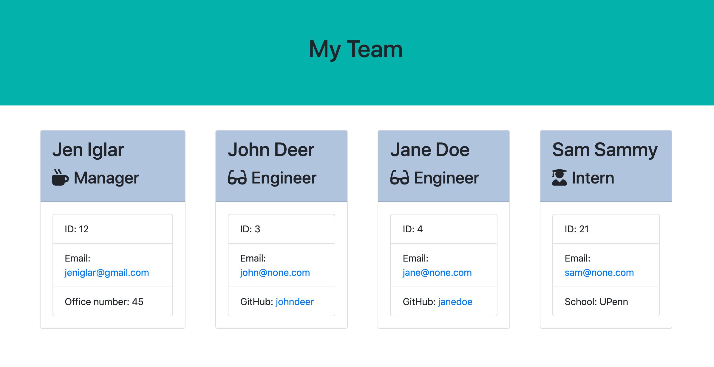

# Team Generator 

## Description 
I have created an Node CLI that takes in employee information and generates a Team Profile webpage that displays a summary for each employee. This application can be used by a manager to create an easy to read team snapshot with essential employee information such as role, ID, email, etc. 

</>

## Table of Contents
- [Installation](#installation)
- [Usage](#usage)
- [License](#license)
- [Contributions](#contributions)
- [Tests](#tests)
- [Questions](#questions) 
  

## Installation
The user will need to have NPM installed prior to running this application.

## Usage
The user will run this application using node in their terminal. They will be prompted to provide information on each employee's name, ID, email address, and additional role specific information. The user can enter as many employees as they like. 

## License
Notice: This is licensed under MIT.

## Contributions 
You may contribute to this application by forking the repository via my GitHub link below.

## Tests 
This application was run through multiple NPM tests. 

## Questions
Please feel free to view my GitHub profile at https://github.com/jeniglar or email me directly at jeniglar@gmail.com with any additional questions.
